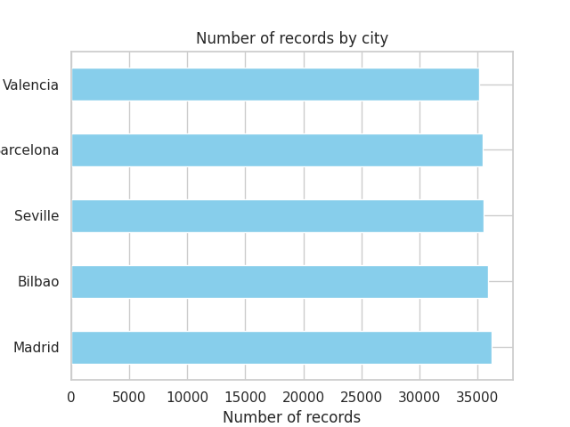
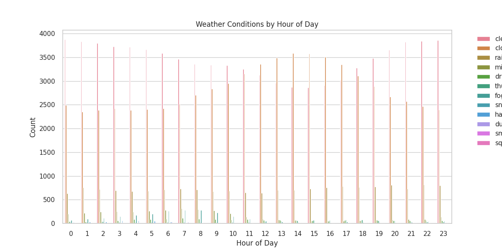
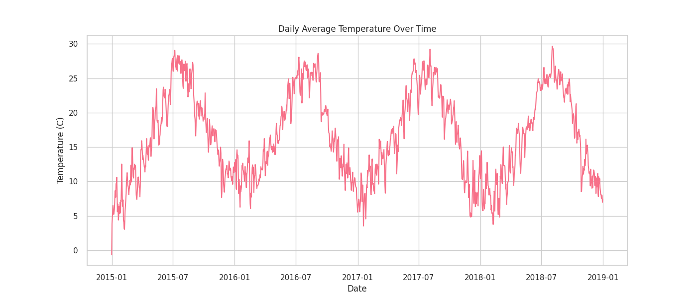
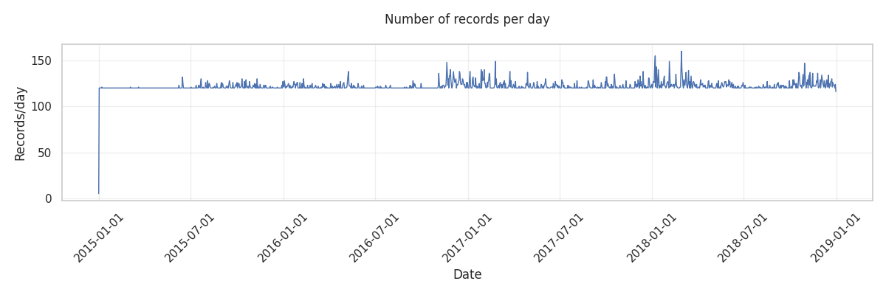
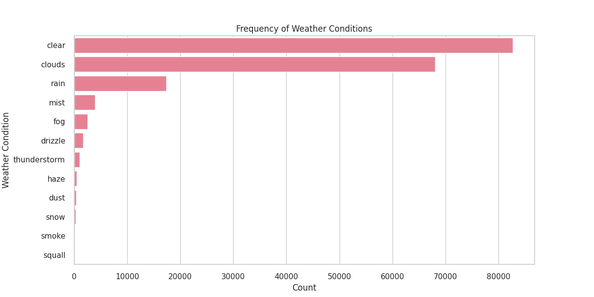
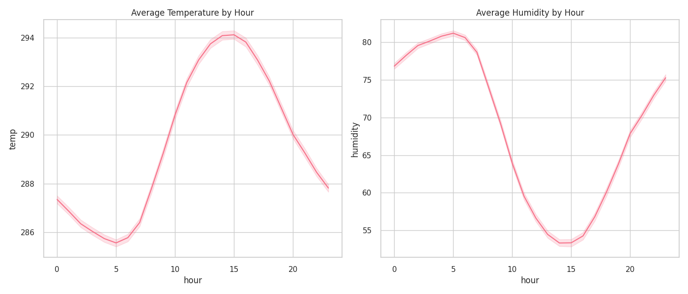
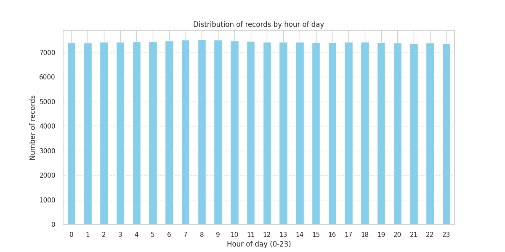
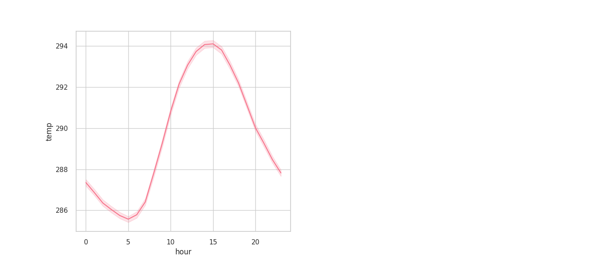

# 🌦️ Análisis Exploratorio de Datos Climáticos en España


## 📜 Descripción

Este proyecto realiza un análisis exploratorio de datos (EDA) sobre condiciones climáticas en varias ciudades españolas (Valencia, Madrid, Bilbao, Barcelona y Sevilla) entre 2015 y 2018. El análisis incluye:

- 🕒 Distribución temporal de registros
- 🌡️ Conversión y análisis de temperaturas (Kelvin a Celsius)
- 🌧️ Patrones de precipitación
- 💨 Análisis de velocidad y dirección del viento
- 📊 Correlaciones entre variables meteorológicas

## 📂 Estructura del Proyecto

```
clima-espana-eda/
├── data/
│   └── weather_features.csv       # Dataset principal con datos climáticos
├── docs/
│   └── informe-ejecutivo-juandomingo.pdf  # Informe con conclusiones
├── imgs/                          # Visualizaciones generadas
│   ├── city-records-number.png
│   ├── correlation-matrix.png
│   ├── hourly-distribution.png
│   ├── kelvin-celsius-temp.png
│   └── ... (más visualizaciones)
├── notebooks/
│   └── spain_weather.ipynb        # Notebook principal de análisis
└── README.md                      # Este archivo
```

## 🔍 Hallazgos Clave

1. **📅 Datos temporales**:
   - Período: Enero 2015 - Diciembre 2018
   - 178,396 registros (≈24 registros diarios por ciudad)

2. **🌆 Distribución por ciudad**:
   - Madrid: 36,267 registros
   - Bilbao: 35,951 registros
   - Sevilla: 35,557 registros
   - Barcelona: 35,476 registros
   - Valencia: 35,145 registros

3. **🌡️ Temperaturas**:
   - Convertidas correctamente de Kelvin a Celsius
   - Distribución normal con media ≈15°C
   - Variación estacional evidente

4. **🌦️ Condiciones climáticas**:
   - "Clear" (cielo despejado) es la condición más frecuente
   - Solo 4.5% de horas con precipitación

5. **📈 Correlaciones**:
   - Variables de temperatura altamente correlacionadas (>0.9)
   - Humedad correlacionada negativamente con temperatura (-0.5)

## 🛠️ Instalación

### Con pip (Linux/Windows):
```bash
pip install -r requirements.txt
```

### Con uv (Linux/Windows):
```bash
uv pip install -r requirements.txt
```

## 📊 Contenido del Notebook

El notebook principal (`spain_weather.ipynb`) contiene:

1. **Configuración inicial**:
   - Importación de bibliotecas (Pandas, Matplotlib, Seaborn)
   - Carga de datos

2. **Análisis exploratorio**:
   - Conversión de unidades (Kelvin → Celsius)
   - Estadísticas descriptivas
   - Visualizaciones de distribución

3. **Análisis temporal**:
   - Patrones diurnos y estacionales
   - Completitud de datos horarios

4. **Análisis multivariado**:
   - Matriz de correlación
   - Relaciones entre variables climáticas

5. **Control de calidad**:
   - Valores faltantes/ceros problemáticos
   - Consistencia entre temp/temp_min/temp_max

## 📋 Requisitos

- Python 3.8+
- Bibliotecas principales:
  ```
  pandas>=1.3.0
  matplotlib>=3.4.0
  seaborn>=0.11.0
  numpy>=1.21.0
  ```

---

## Grafos

Se presentan algunas de las visualizaciones generadas a partir del análisis exploratorio de los datos:

### Distribución de registros por ciudad
  
*El gráfico muestra la cantidad de registros disponibles para cada ciudad, destacando Madrid como la ciudad con mayor representación en el dataset.*

### Condiciones meteorológicas por hora del día
  
*Visualización que relaciona las condiciones climáticas (como lluvia, niebla o cielos despejados) con las diferentes horas del día.*

### Temperatura promedio diaria a lo largo del tiempo
  
*Evolución de las temperaturas promedio desde 2015 hasta 2019, mostrando patrones estacionales claros.*

### Registros por día
  
*Distribución temporal de los registros disponibles, mostrando la cobertura temporal del dataset.*

### Frecuencia de condiciones meteorológicas
  
*Análisis de la prevalencia de diferentes condiciones climáticas en el conjunto de datos, siendo "clear" (despejado) la más común.*

### Humedad y temperatura promedio por hora
  
*Relación entre la hora del día y los valores promedio de humedad y temperatura.*

### Distribución horaria de registros
  
*Concentración de registros según la hora del día, mostrando mayor actividad durante las horas diurnas.*

### Temperatura promedio por hora
  
*Variación de la temperatura a lo largo de las diferentes horas del día.*

### Distribución de humedad y presión
  
*Histogramas que muestran la distribución de los valores de humedad y presión atmosférica en los datos.*

---


## 📄 Licencia

Este proyecto está bajo licencia [GNU GPLv3](https://www.gnu.org/licenses/gpl-3.0.html).

```text
Copyright (C) 2023 Juan Domingo

Este programa es software libre: puedes redistribuirlo y/o modificarlo
bajo los términos de la GNU General Public License como está publicada
por la Free Software Foundation, ya sea la versión 3 de la Licencia, o
(a tu elección) cualquier versión posterior.

Este programa se distribuye con la esperanza de que sea útil,
pero SIN NINGUNA GARANTÍA; sin siquiera la garantía implícita de
COMERCIABILIDAD o APTITUD PARA UN PROPÓSITO PARTICULAR. Ver la
GNU General Public License para más detalles.
```

## 👏 Contribuciones

Las contribuciones son bienvenidas. Por favor, abre un issue primero para discutir los cambios propuestos.

## 📧 Contacto

Para preguntas sobre el proyecto, contactar a [Juan Domingo](mailto:jdomingodev@duck.com).
